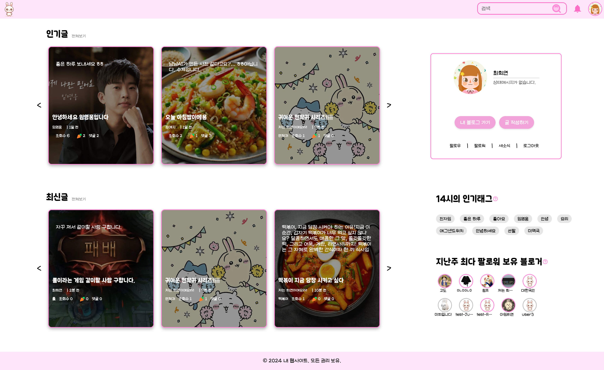
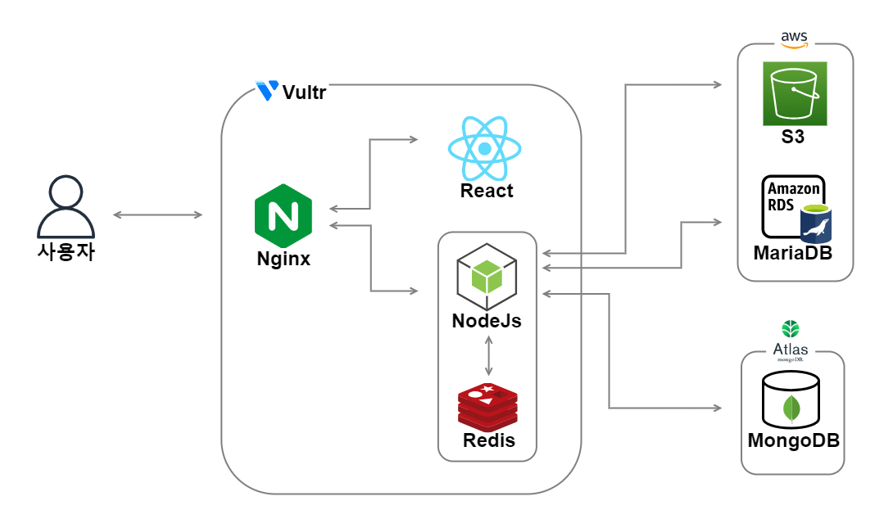

## 🌸 공감과 이야기가 피어나는 블로그

> 사람들이 댓글과 게시글을 통해 생각과 이야기를 나누고, 사용자 프로필 및 게시글을 손쉽게 관리할 수 있도록 설계된 **사용자 중심의 블로그 플랫폼**입니다.

---

## 📚 목차

- [🖥️ 서버 구조](#🖥️-서버-구조)
- [💻 화면 설계](#💻-화면-설계)
- [⚙️ 기술 스택](#⚙️-기술-스택)
- [🛠️ 주요 화면 소개](#🛠️-주요-화면-소개)
  > [화면 1: 로그인 및 회원가입](#기능-1-인증-구현)  
  > [기능 2: 게시판 및 카테고리 구현](#기능-2-게시판-및-카테고리-구현)  
  > [기능 3: 사용자 팔로우 및 프로필 관리](#기능-3-사용자-팔로우-및-프로필-관리)  
  > [기능 4: 임시 저장 기능](#기능-4-임시-저장-기능)
- [👥 팀원 소개](#👥-팀원-소개)

---

## 🖥️ 서버 구조

---

## 💻 화면 설계

👉 
<iframe style="border: 1px solid rgba(0, 0, 0, 0.1);" width="800" height="450" src="https://embed.figma.com/design/oLBgJllzx29LyORdwuDxPy/%EB%B8%94%EB%A1%9C%EA%B7%B8?node-id=0-1&embed-host=share" allowfullscreen></iframe>

---

## ⚙️ 기술 스택

| **분류**     | **스택**                                                                                                                                                                                                                                                                                                                                                                                                                        |
| ------------ | ------------------------------------------------------------------------------------------------------------------------------------------------------------------------------------------------------------------------------------------------------------------------------------------------------------------------------------------------------------------------------------------------------------------------------- |
| **Frontend** |                                                                                                                                                                                                                                                                                                                               |
| **Backend**  |                                                                                                                                                                                                              |
| **Database** |     |

---

## 🛠️ 주요 기능 소개

### 기능 1: 인증 구현

- **로컬 회원가입 및 로그인**: 사용자가 아이디와 비밀번호로 간편하게 로그인할 수 있는 기능을 제공합니다.

  

    
로컬 로그인 흐름 보기

 
  

- **구글 로그인**: 구글 OAuth를 이용하여 간편하게 로그인할 수 있습니다.

  

    
구글 로그인 흐름 보기

  1. 사용자가 구글 로그인을 시도
  2. 백엔드에서 구글 OAuth 처리 후, 사용자 정보가 로컬 DB에 있으면 로그인, 없으면 자동으로 회원가입 처리
  3. 로그인 성공 후 JWT 토큰을 발급하여 사용자에게 반환

  

- **로그인된 사용자 인증**: JWT 토큰을 통해 사용자 인증을 처리하고, 토큰이 없을 경우 발급된 쿠키로 동일 사용자인지 확인합니다.

  

    
로그인된 사용자 인증 흐름 보기

 

  

---

### 기능 2: 게시판 및 카테고리 구현

- **이미지 업로드**: **AWS S3**를 이용하여 게시글에 이미지를 포함시킬 수 있습니다.
  

    
S3를 통한 이미지 업로드 흐름 보기

  
  

- **캐시 처리**: **Redis**를 활용하여 조회수 및 좋아요 데이터를 효율적으로 처리합니다.
- **게시판 및 카테고리 CRUD**: 게시글과 카테고리를 생성, 조회, 수정, 삭제할 수 있는 기능을 제공합니다.

---

### 기능 3: 사용자 팔로우 및 프로필 관리

- **사용자 알림 기능**: 게시글에 댓글이나 좋아요가 달리면 실시간으로 알림을 받을 수 있습니다. (SSE 사용)

  

    
SSE 연결 및 알림 수신 흐름 보기

  

- **팔로우/언팔로우 기능**: 다른 사용자를 팔로우하거나 팔로우를 취소할 수 있습니다.
- **프로필 관리**: 프로필 사진 및 사용자 정보를 손쉽게 수정할 수 있는 기능을 제공합니다.

---

### 기능 4: 임시 저장 기능

- **게시글 임시 저장**: 작성 중인 게시글을 임시로 저장하고, 나중에 불러와서 다시 작성할 수 있는 기능을 제공합니다. **MongoDB**를 사용하여 임시 저장을 구현하였습니다.

---

## 👥 팀원 소개

|                   프론트엔드 개발                   |                    백엔드 개발                    |
| :-------------------------------------------------: | :-----------------------------------------------: |
|  |  |
|    **[최희연](https://github.com/heeyeon9578)**     |      **[정예지](https://github.com/xEzIxX)**      |

---
