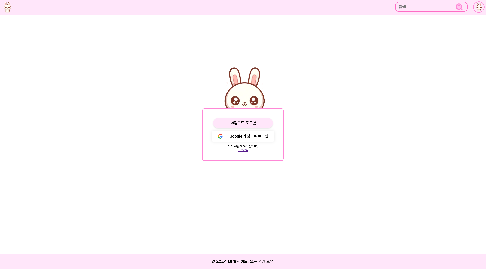

## 🌸 공감과 이야기가 피어나는 블로그

> 사람들이 댓글과 게시글을 통해 생각과 이야기를 나누고, 사용자 프로필 및 게시글을 손쉽게 관리할 수 있도록 설계된 **사용자 중심의 블로그 플랫폼**입니다.

---

## 📚 목차

- [🖥️ 서버 구조](#🖥️-서버-구조)
- [💻 화면 설계](#💻-화면-설계)
- [⚙️ 기술 스택](#⚙️-기술-스택)
- [🛠️ 주요 화면 소개](#🛠️-주요-화면-소개)
  > [화면 1: 회원가입/로그인/비밀번호 찾기/로그아웃/회원탈퇴](#화면-1-회원가입/로그인/비밀번호-찾기/로그아웃/회원탈퇴)  
  > [기능 2: 게시판 및 카테고리 구현](#기능-2-게시판-및-카테고리-구현)  
  > [기능 3: 사용자 팔로우 및 프로필 관리](#기능-3-사용자-팔로우-및-프로필-관리)  
  > [기능 4: 임시 저장 기능](#기능-4-임시-저장-기능)
- [👥 팀원 소개](#👥-팀원-소개)

---

## 🖥️ 서버 구조

---

## 💻 화면 설계

 (https://www.figma.com/design/oLBgJllzx29LyORdwuDxPy/%EB%B8%94%EB%A1%9C%EA%B7%B8?node-id=0-1&t=WHfwLbrHGKrM6WwB-1)

---

## ⚙️ 기술 스택

| **분류**     | **스택**                                                                                                                                                                                                                                                                                                                                                                                                                        |
| ------------ | ------------------------------------------------------------------------------------------------------------------------------------------------------------------------------------------------------------------------------------------------------------------------------------------------------------------------------------------------------------------------------------------------------------------------------- |
| **Frontend** |                                                                                                                                                                                                                                                                                                                               |
| **Backend**  |                                                                                                                                                                                                              |
| **Database** |     |

---

## 🛠️ 주요 화면 소개

### 화면 1: 회원가입/로그인/비밀번호 찾기/로그아웃/회원탈퇴

- **회원가입**: 사용자가 조건에 맞는 아이디(실존하는 이메일), 인증번호, 비밀번호, 닉네임을 입력하여 회원가입하거나, 구글 아이디를 통해 회원가입합니다.

   

    
회원가입 페이지

     
    

    > 회원가입 버튼을 누르면, 계정 또는 구글로 회원가입할 수 있는 버튼이 도출됩니다. 
 
  

  

    
로컬 회원가입 페이지

    
    
  
    > 아아디로 사용할 이메일을 입력 후, 인증번호 전송을 클릭하면 해당 이메일로 인증번호가 전송됩니다.
    
    
  
    > 이메일로 받은 인증번호입니다.
    
     
  
    > 이메일 인증, 사용할 비밀번호, 닉네임의 조건을 모두 만족하면 회원가입 버튼이 disable -> able 상태가 되어 클릭할 수 있습니다.
 
  

   

    
구글 회원가입 페이지

     
    

    > 구글 아이디를 클릭하여 해당 서비스에 회원가입할 수 있습니다.
    
    

    > 닉네임 설정 페이지가 도출되며, 입력한 닉네임으로 활동하게 됩니다. 추후에 수정할 수 있습니다.
  
  

- **로그인**: 사용자가 회원가입할 때 사용한 아이디(이메일)과 비밀번호를 통해 로그인합니다.

  

    
로그인 페이지

     
    

    > 로그인 버튼을 누르면, 계정 또는 구글로 로그인할 수 있는 버튼이 도출됩니다. 
 
  

  

    
로컬 로그인 페이지

    
    
  
    > 로컬 회원가입때 사용한 이메일과 비밀번호를 입력하여 로그인합니다.

  

   

    
구글 로그인 페이지

     
    

    > 구글 아이디를 클릭하여 해당 서비스에 회원가입할때 사용한 이메일로 로그인할 수 있습니다.
    
  

- **비밀번호 찾기**: 사용자가 비밀번호를 잊어버렸을 경우, 가입한 이메일을 통해 새로운 비밀번호 인증코드를 받아 로그인할 수 있습니다.
  
  

    
비밀번호 찾기 페이지

   

    > 비밀번호를 찾고 싶은 아이디를 입력 후 인증번호 전송버튼을 클릭합니다.

    

    > 해당 이메일로 발송된 메일에 쓰여있는 임시 비밀번호를 사용하여 임시 로그인합니다.

  

- **로그아웃**: 사용자가 서비스에서 로그아웃 버튼을 클릭하여 로그아웃합니다.

- **회원 탈퇴**: 사용자가 서비스를 탈퇴하여 개인정보를 삭제합니다.
  
  

    
로컬 회원 탈퇴 페이지

    

    > 로그인할 때 사용한 이메일과 비밀번호 및 비밀번호 확인란을 조건에 맞게 채우면 회원 탈퇴하기 버튼이 활성화됩니다.
    
     
구글 회원 탈퇴 페이지

    

    > 로그인할 때 사용한 이메일과 비밀번호 및 비밀번호 확인란을 조건에 맞게 채우면 회원 탈퇴하기 버튼이 활성화됩니다.

  

---

### 화면 2: 개인 블로그 

- **개인 블로그 메인 페이지**: 
  

    
개인 블로그 메인 페이지

  
  

- **개인 블로그 관리 페이지(게시글 관리/카테고리 관리)**:
  

---

### 화면 3: 게시글 작성 / 임시저장 /수정 

- **개인 블로그 메인 페이지**: 
  

    
개인 블로그 메인 페이지

  
  

- **개인 블로그 관리 페이지(게시글 관리/카테고리 관리)**:

- - **게시글 상세 페이지**:
  

---

### 화면 4: 인기글 / 최신글 / 태그 별 게시글 전체보기

- **인기글 / 최신글 전체보기 페이지**: 
  

    
개인 블로그 메인 페이지

  
  

- **검색 페이지**:

- **태그 별 검색 페이지**:

---

### 화면 5: 팔로우/ 팔로워

- **팔로우 페이지**: 

  

    
SSE 연결 및 알림 수신 흐름 보기

  

- **팔로워 페이지**: 

---

### 화면 6: 알림 

- **알림 페이지**: 

---

### 화면 7: 프로필 설정

- **알림 페이지**: 

---

## 👥 팀원 소개

|                   프론트엔드 개발                   |                    백엔드 개발                    |
| :-------------------------------------------------: | :-----------------------------------------------: |
|  |  |
|    **[최희연](https://github.com/heeyeon9578)**     |      **[정예지](https://github.com/xEzIxX)**      |

---
